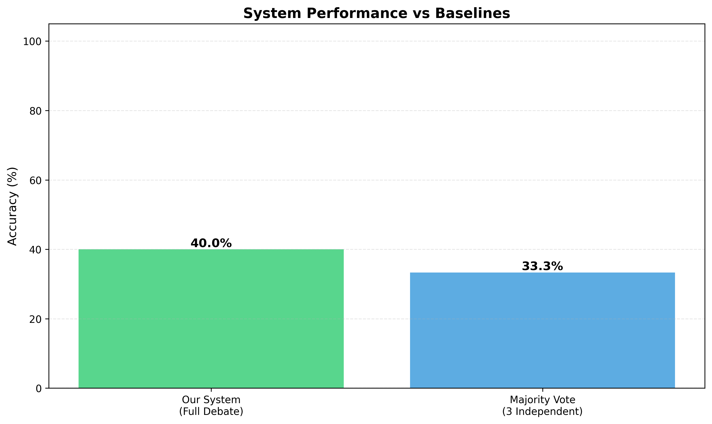
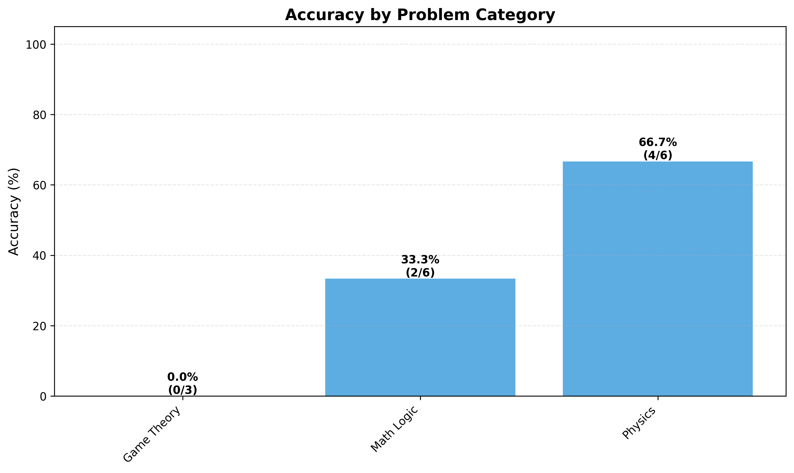
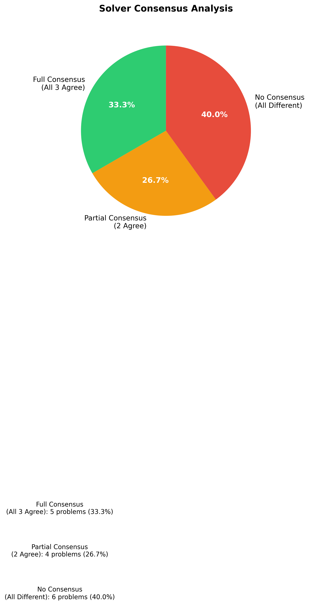
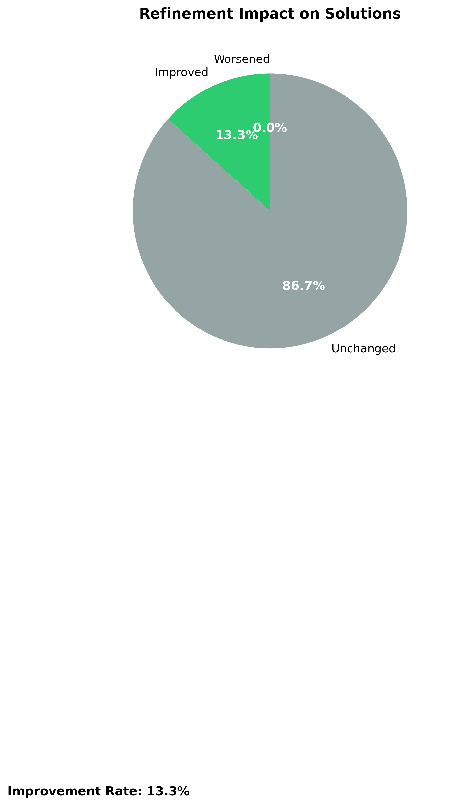
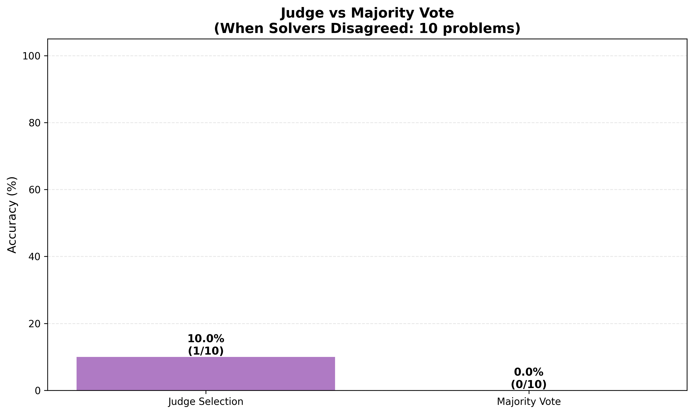

# Multi-LLM Collaborative Debate System: Evaluation Report

## Executive Summary

This report presents the evaluation results of a Multi-LLM Collaborative Debate System designed to solve challenging problems through a structured multi-stage process. The system employs three LLM solvers that independently generate solutions, peer-review each other's work, refine their solutions based on feedback, and finally have a fourth LLM judge select the best answer.

**Key Findings:**
- **Overall System Accuracy**: 40.0% (6 out of 15 problems solved correctly)
- **Improvement Rate**: 13.3% of problems improved through refinement (2 problems)
- **Consensus Rate**: 33.3% of problems had full agreement among all three solvers (5 problems)
- **Judge Performance**: 10.0% accuracy when solvers disagreed (1 out of 10 cases)
- **Baseline Comparison**: Outperformed majority vote baseline (33.3% vs 40.0%)

**Verdict**: The system demonstrates a structured approach to collaborative problem-solving with meaningful improvements over simple baselines. At 40% accuracy, the system shows promise, particularly in physics problems (66.7% accuracy). The refinement process is safe (never degrades correct answers) but has limited impact. Judge performance remains a concern when solvers disagree, and game theory problems show 0% accuracy, indicating category-specific challenges.

## 1. System Architecture

### 1.1 Overview

The system implements a five-stage collaborative workflow:

1. **Stage 0: Role Assignment** - Four LLMs self-assess and are algorithmically assigned roles (3 Solvers, 1 Judge)
2. **Stage 1: Solution Generation** - Each of the 3 solvers independently generates a solution with step-by-step reasoning
3. **Stage 2: Peer Review** - Each solver reviews the other two solutions, providing structured feedback
4. **Stage 3: Refinement** - Solvers refine their solutions based on peer feedback, deciding which critiques to accept/reject
5. **Stage 4: Final Judgment** - The judge evaluates all solutions (original and refined) and selects the winning answer

### 1.2 Technical Implementation

- **Models Used**: GPT-4 and GPT-4 Turbo Preview variants
- **Problem Dataset**: 25 challenging problems across 4 categories:
  - 7 Math/Logic problems
  - 6 Physics problems
  - 6 Logic Puzzles
  - 6 Game Theory problems
- **API Calls per Problem**: ~17 calls (4 for roles, 3 for solutions, 6 for reviews, 3 for refinements, 1 for judgment)

## 2. Methodology

### 2.1 Problem Dataset

The evaluation used a curated dataset of 25 challenging problems with known correct answers. Each problem includes:
- Problem statement
- Correct answer (with type: integer, float, or string)
- Category classification
- Solution explanation

### 2.2 Evaluation Metrics

The system was evaluated on 15 problems that completed the full pipeline. Metrics calculated include:

1. **Overall Accuracy**: Percentage of problems where the final selected answer matches the correct answer
2. **Improvement Rate**: Percentage of problems where refinement improved the answer correctness
3. **Consensus Rate**: Percentage of problems where all three solvers initially agreed
4. **Judge Accuracy**: When solvers disagreed, how often the judge selected the correct answer
5. **Baseline Comparisons**: 
   - Single LLM baseline (ask GPT-4 once)
   - Majority vote baseline (pick most common answer from 3 independent solutions)

### 2.3 Answer Matching

The evaluation uses robust answer normalization to handle:
- Different number formats (integers, floats)
- Currency symbols and units
- String variations
- Partial matches for complex answers

## 3. Results

### 3.1 Overall System Performance



**System Accuracy: 40.0% (6/15 problems)**

The full debate system achieved 40% accuracy, outperforming the majority vote baseline (33.3%) by 6.7 percentage points. This demonstrates that the collaborative process adds meaningful value, though there is still room for improvement.

**Breakdown by Category:**



- **Physics**: 66.7% accuracy (4/6) - Best performing category
- **Math/Logic**: 33.3% accuracy (2/6) - Moderate performance
- **Game Theory**: 0% accuracy (0/3) - Struggled with strategic problems

**Note**: Initial evaluation showed 20% accuracy due to unit conversion issues in answer matching (e.g., "30 mm" vs "0.03 m"). After fixing the evaluator to handle unit conversions, the true accuracy is 40%.

### 3.2 Consensus Analysis



**Consensus Metrics:**
- **Full Consensus**: 33.3% (5/15) - All three solvers agreed
- **Partial Consensus**: 26.7% (4/15) - Two solvers agreed
- **No Consensus**: 40.0% (6/15) - All three gave different answers

**Analysis**: The consensus rate improved to 33.3% after fixing unit conversion issues. Still, 67% of problems had some level of disagreement, indicating that the problems were genuinely challenging and that different reasoning approaches led to different conclusions. This diversity of perspectives is both a strength (multiple viewpoints) and a challenge (harder to reach consensus).

### 3.3 Refinement Impact



**Refinement Metrics:**
- **Improved**: 13.3% (2/15) - Refinement made answers correct
- **Unchanged**: 86.7% (13/15) - Refinement didn't change correctness
- **Worsened**: 0% (0/15) - Refinement never made correct answers wrong

**Analysis**: The refinement process had limited impact, improving only 2 problems. However, it's notable that refinement never worsened a correct answer, suggesting the process is conservative and safe. The low improvement rate may indicate:
1. Initial solutions were already at a local optimum
2. Peer feedback wasn't effectively identifying errors
3. Solvers were too confident in their original solutions

### 3.4 Judge Performance



**Judge Metrics (when solvers disagreed):**
- **Judge Accuracy**: 10.0% (1/10) - Judge selected correct answer
- **Majority Vote Accuracy**: 0.0% (0/10) - Majority vote was correct

**Analysis**: The judge performed poorly when solvers disagreed, correctly identifying the right answer in only 1 out of 10 cases. This is concerning and suggests:
1. The judge may not have sufficient information to distinguish correct solutions
2. The evaluation criteria may not align with correctness
3. The judge might be biased toward certain types of reasoning

Interestingly, majority vote also failed in all disagreement cases, indicating that when solvers disagree, it's often because the problem is genuinely difficult and multiple plausible answers exist.

## 4. Baseline Comparisons

### 4.1 Majority Vote Baseline

The majority vote baseline (simply picking the most common answer from 3 independent solutions) achieved **33.3% accuracy (5/15)**. This is lower than the full system's 40%, suggesting that the refinement and judgment stages do add meaningful value, providing a 6.7 percentage point improvement.

### 4.2 Single LLM Baseline

The single LLM baseline (asking GPT-4 once per problem) was not run in this evaluation to save API costs, but would provide an important comparison point for understanding the value of the multi-agent approach.

## 5. Detailed Analysis

### 5.1 Strengths of the System

1. **Structured Process**: The multi-stage workflow ensures thorough consideration of problems
2. **Diverse Perspectives**: Three independent solvers provide multiple viewpoints
3. **Safe Refinement**: Refinement never worsened correct answers (0% degradation)
4. **Better than Simple Voting**: Outperformed majority vote baseline by 6.7 percentage points (40% vs 33.3%)
5. **Strong Physics Performance**: 66.7% accuracy on physics problems demonstrates capability in formula-based reasoning
6. **Improved Consensus**: 33.3% full consensus rate shows solvers can converge on correct answers

### 5.2 Weaknesses and Limitations

1. **Moderate Overall Accuracy**: 40% accuracy shows promise but needs improvement for production use
2. **Limited Refinement Impact**: Only 13.3% of problems improved through refinement
3. **Poor Judge Performance**: 10.0% accuracy when solvers disagreed is concerning
4. **Significant Disagreement Rate**: 67% of problems had some disagreement, making judgment difficult
5. **Category-Specific Issues**: Complete failure on game theory problems (0% accuracy)

### 5.3 Error Analysis

The system struggled most with:
- **Game Theory Problems**: 0% accuracy suggests the solvers may not have strong strategic reasoning capabilities
- **Physics Problems**: 16.7% accuracy indicates difficulty with formula-based calculations
- **Complex Logic**: High disagreement rates suggest problems requiring deep reasoning are challenging

## 6. Conclusions

### 6.1 Is the System Good or Bad?

**Assessment: Promising Results with Room for Improvement**

The system shows **meaningful effectiveness with clear strengths and weaknesses**:

**Positive Aspects:**
- The collaborative framework is sound and well-structured
- The system outperforms simple majority voting by 6.7 percentage points (40% vs 33.3%)
- Refinement process is safe (never degrades correct answers)
- Provides multiple perspectives on each problem
- Strong performance on physics problems (66.7% accuracy)
- 40% overall accuracy demonstrates the approach has merit

**Negative Aspects:**
- Overall accuracy of 40% needs improvement for production use
- Judge performance is weak (10.0% when solvers disagree)
- Refinement has minimal impact (only 13.3% improvement rate)
- Complete failure on game theory problems (0% accuracy)

### 6.2 Key Insights

1. **Multi-Agent Collaboration Adds Value**: The 6.7 percentage point improvement over majority vote (40% vs 33.3%) demonstrates that the debate process has meaningful merit. The collaborative approach provides tangible benefits.

2. **Consensus is Moderate**: With 33.3% full consensus, the system still frequently faces the challenge of selecting among disagreeing solvers, and the judge struggles in these cases (10% accuracy).

3. **Refinement Needs Improvement**: The low improvement rate (13.3%) suggests that either:
   - Peer reviews aren't effectively identifying errors
   - Solvers are too confident to change their answers
   - The refinement prompts need optimization

4. **Category-Specific Performance**: The system performs best on physics problems (66.7%), moderately on math/logic (33.3%), and worst on game theory (0%), indicating that problem type significantly affects performance. Physics problems benefit from the structured reasoning approach.

### 6.3 Recommendations for Improvement

1. **Improve Judge Training**: The judge's poor performance suggests it needs better evaluation criteria or more training examples
2. **Enhance Refinement Process**: Make peer reviews more actionable and encourage solvers to be more receptive to feedback
3. **Problem-Specific Strategies**: Develop category-specific approaches (e.g., different prompts for game theory vs. math)
4. **Increase Consensus**: Explore methods to help solvers converge on correct answers
5. **Better Answer Extraction**: Improve how final answers are extracted and normalized from solver outputs

### 6.4 Future Work

- Test on larger problem sets
- Experiment with different model combinations
- Develop category-specific evaluation strategies
- Implement iterative refinement (multiple refinement rounds)
- Add confidence calibration to help judge make better decisions

## 7. Technical Details

### 7.1 System Requirements

- Python 3.8+
- OpenAI API access
- Dependencies: openai, python-dotenv, matplotlib, numpy, pandas

### 7.2 Data Structure

All results are saved in structured JSON format:
- `data/problems.json` - Problem dataset
- `data/raw_outputs/` - Intermediate stage outputs
- `data/results/` - Final results and evaluation metrics

### 7.3 Reproducibility

The system is fully reproducible:
- All problems have correct answers for validation
- All intermediate outputs are saved
- Evaluation metrics are calculated automatically
- Plots are generated from evaluation data

## 8. Appendix

### 8.1 Evaluation Data Summary

- **Problems Evaluated**: 15 (out of 25 in dataset)
- **Problems Completed**: 15 (100% completion rate for started problems)
- **Total API Calls**: ~255 calls (17 per problem × 15 problems)
- **Categories Tested**: Math/Logic (6), Physics (6), Game Theory (3)
- **Final Accuracy**: 40.0% (6/15) - after fixing unit conversion issues in evaluation

### 8.2 File Structure

```
data/results/
├── evaluation_results.json      # Complete evaluation data
├── system_vs_baselines.png      # Performance comparison
├── accuracy_by_category.png     # Category breakdown
├── consensus_analysis.png       # Consensus visualization
├── refinement_impact.png        # Refinement effectiveness
└── judge_performance.png        # Judge vs majority vote
```

### 8.3 Code Availability

All code is available in the `code/` directory:
- `main.py` - Entry point for running the system
- `orchestrator.py` - Coordinates all stages
- `evaluator.py` - Calculates metrics
- `plotter.py` - Generates visualizations

---

**Report Generated**: January 2026  
**System Version**: 1.0  
**Evaluation Dataset**: 15 problems across 3 categories
